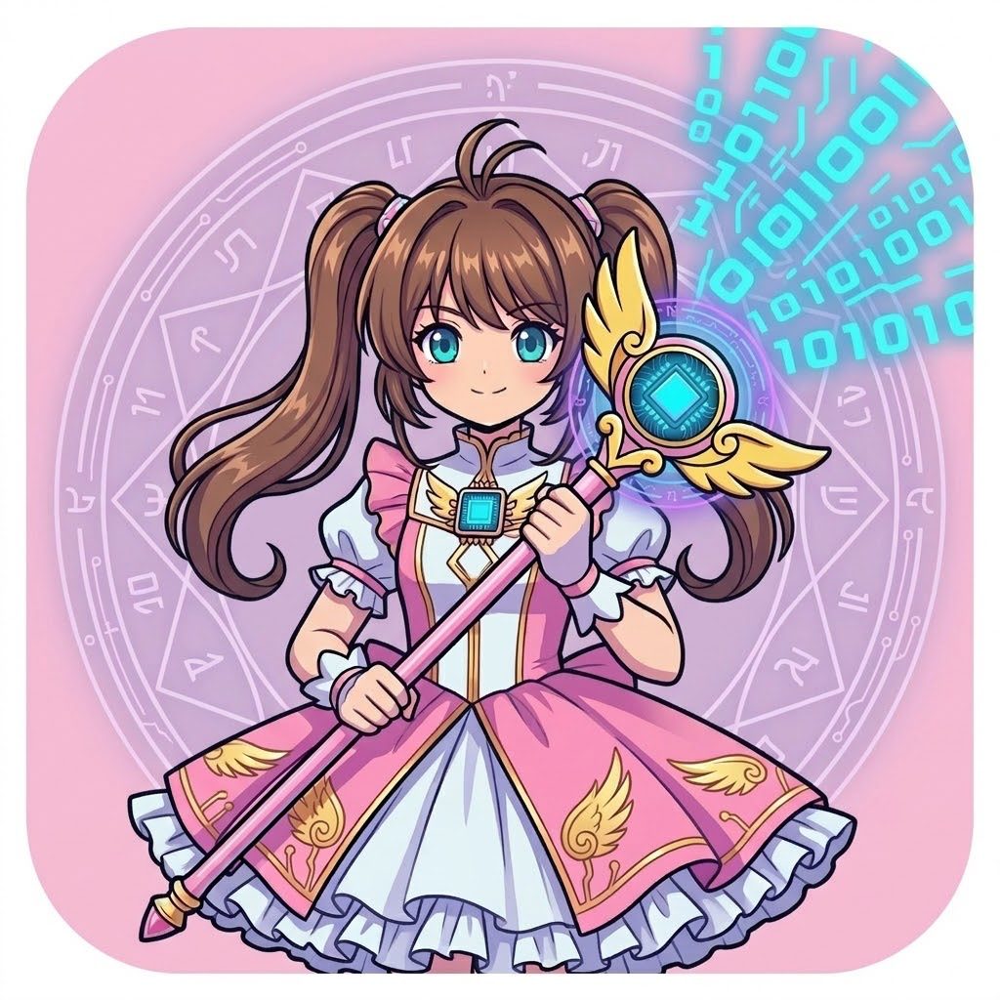
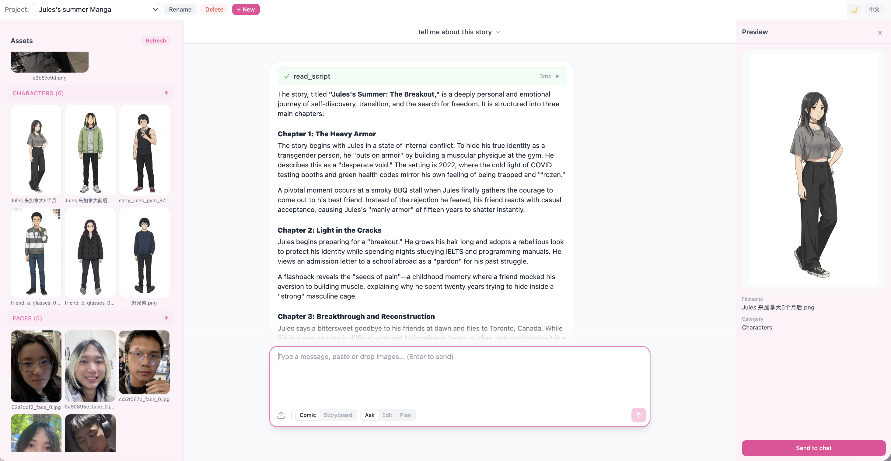
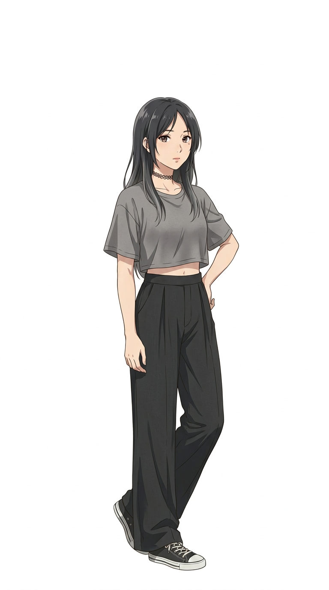
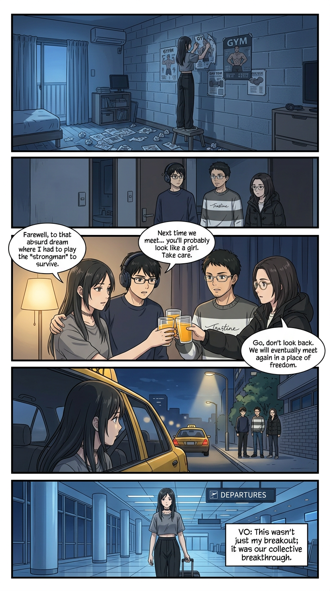
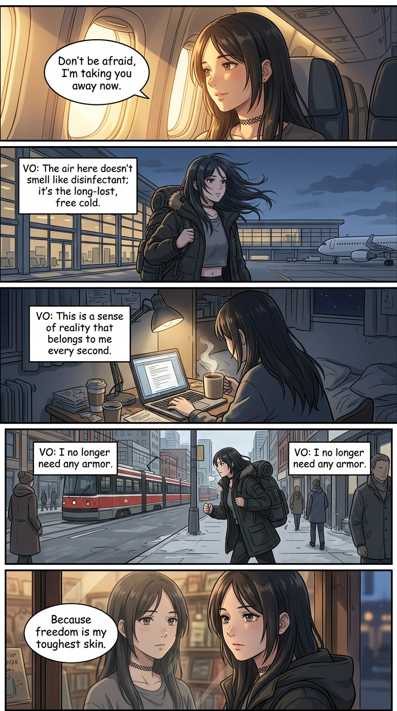
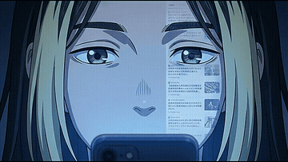

<p align="center">
  
</p>

<h1 align="center">Animegent</h1>

<p align="center">
  Your personal AI anime studio.<br/>
  Photos to manga and animation in one conversation.
</p>

<p align="center">
  
  
</p>

<p align="center">
  <a href="https://www.youtube.com/watch?v=OhFAgBwdZ2s">
    
  </a>
  <br/>
  <a href="https://www.youtube.com/watch?v=OhFAgBwdZ2s">Watch Demo Video</a>
</p>

---

## What is Animegent?

Animegent turns ordinary photographs into anime-style comic strips and animated short videos through a conversational AI agent.

Upload a photo of your friends, your family, your community. Animegent detects each face, transforms everyone into an anime character that looks like *them*, writes a story, and generates a complete manga page or animated video. The same person keeps their consistent anime identity across every panel, every scene, and every animation.

You don't draw. You don't write prompts. You just talk to Animegent like a creative partner.

## Screenshots

<p align="center">
  
  <br/><em>Chat with Animegent to create your story</em>
</p>

<p align="center">
  
  <br/><em>Photo to anime character with preserved identity</em>
</p>

<p align="center">
  
  
  <br/><em>AI-generated multi-panel manga</em>
</p>

<p align="center">
  
  
  
  <br/><em>Generated animation clips</em>
</p>

## Features

- **Photo to Anime Character**: face detection + full-body anime stylization that preserves hairstyle, outfit, and identity
- **Comic Strip Generation**: AI writes scripts and generates multi-panel vertical manga
- **Animation**: storyboard frames to animated video clips with voice acting, auto-merged into a final short
- **Character Consistency**: same person recognized across photos via face-embedding clustering
- **Human-in-the-Loop**: AI proposes plans, you confirm. DAG-based execution with live progress streaming
- **Bilingual**: full Chinese and English support

## Quick Start

### Prerequisites

- Python 3.11+ with [uv](https://github.com/astral-sh/uv)
- Node.js 18+
- API keys for Gemini (via proxy)

### Setup

```bash
# Clone
git clone https://github.com/your-username/animegent.git
cd animegent

# Environment
cp .env.example .env
# Edit .env: add API_KEYS and BASE_URL

# Backend
uv sync
uv run uvicorn src.web.api:app --reload --port 8000

# Frontend
cd web/frontend
npm install
npm run dev
```

Open http://localhost:5173 in your browser.

### Environment Variables

| Variable | Description |
|----------|-------------|
| `API_KEYS` | Comma-separated Gemini API keys (round-robin with failover) |
| `BASE_URL` | API proxy URL |

## Architecture

```
                    ┌─────────────┐
                    │   Frontend   │
                    │  React+Vite  │
                    └──────┬───────┘
                           │ SSE
                    ┌──────▼───────┐
                    │   FastAPI    │
                    │   Backend    │
                    └──────┬───────┘
                           │
                    ┌──────▼───────┐
                    │ Gemini Agent │
                    │  15+ Tools   │
                    └──────┬───────┘
                           │
          ┌────────────────┼────────────────┐
          │                │                │
   ┌──────▼──────┐  ┌─────▼──────┐  ┌──────▼──────┐
   │  InsightFace │  │  Gemini    │  │  Gemini     │
   │  Face Detect │  │  Image Gen │  │  VLM        │
   └─────────────┘  └────────────┘  └─────────────┘
```

- **Backend**: FastAPI + Gemini function calling (SSE streaming agent pattern)
- **Frontend**: React + TypeScript + Vite + Tailwind CSS v3
- **AI Models**: Gemini 3-flash (chat), 3.1-flash (image gen), 2.5-flash-lite (VLM)
- **Face Detection**: InsightFace (buffalo_l, local CPU)
- **Database**: SQLite with WAL mode for conversation persistence

## How It Works

1. **Upload photos** and Animegent detects every face
2. **Select faces** to stylize into full-body anime characters
3. **Describe your story** in natural language
4. **AI plans and executes**: script writing, panel generation, video synthesis
5. **Review and refine** at every step with human-in-the-loop controls

Complex tasks use DAG-based plans where independent steps run concurrently and gated steps pause for your confirmation.

## Project Structure

```
src/
  web/
    api.py              # FastAPI routes, SSE chat endpoint
    agent.py            # Gemini agent, tool dispatch, DAG executor
    db.py               # SQLite conversation persistence
  tools/                # Face detection, stylization, image/video gen
  mcp_tools/            # MCP tool definitions for external clients
web/frontend/src/
  components/           # React components
  api.ts                # SSE parser, API client
  i18n.ts               # Bilingual translations (zh/en)
projects/{name}/        # Per-project asset storage
  input/                # Uploaded photos
  output/               # Generated assets
  style.md              # Project style guide (zh)
  style_en.md           # Project style guide (en)
```

## Tech Stack

| Layer | Technology |
|-------|-----------|
| AI | Google Gemini (3-flash, 3.1-flash, 2.5-flash-lite) |
| Backend | Python, FastAPI, SQLite |
| Frontend | React, TypeScript, Vite, Tailwind CSS |
| Face Detection | InsightFace (buffalo_l) |
| Video | FFmpeg |
| Interop | Model Context Protocol (MCP) |

## License

MIT

---

<p align="center">
  Built for <strong>GenAI Genesis 2026</strong>
</p>
